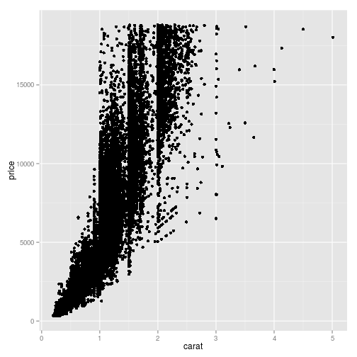

How to visualize insights from data? Part II
========================================================
author: Adomas
date: 2014-11-27

HW solutions & book
========================================================

Homework solutions to `ggplot2` part 1 homework could be [found here](https://github.com/adomasb/pres-ggplot2-part1/blob/gh-pages/solutions.R). 

[Book of `ggplot2` creator Hadley Wickam about **elegant graphics for data analysis**](http://www.bioinformaticslaboratory.nl/twikidata/pub/Education/ComputinginR/ggplot2-book.pdf)


Motivation of second part
========================================================

Plan of workshop
========================================================

- `diamonds` data set
- `ggplot` object
- `geom` - geometric objects
- Multiple plots
- Fill & colour
- Facetting
- Homework

Diamonds dataset
=======================================================

We will use `diamonds` data set from `ggplot2` library.

Thus when library is loaded, `data.frame` called `diamonds` appears.

Make this `data.frame` as `data.table` and take a look at first few lines.


ggplot object
========================================================

Already covered `qplot()` is very powerful tool when plotting quick plots with a single data set. 

If we want to create multilayered plots based on different data sets, then `qplot` is not gonna help.

Thus firstly we have to create `ggplot` object and then incrementally add new plots with `+` operator.

=======================================================

Basic syntax of `ggplot` object 


```r
ggplot(data, aes(x, y, <other aesthetics>))
```

This only creates object and would display anything, thus geometric objects should be added.

Geometric objects
=======================================================

Geometric objects called `geoms` decribes of plot you want to produce

- `geom_point()`
- `geom_line()`
- `geom_histogram()`
- `geom_bar()`
- `geom_boxplot()`

more information could be found on [documentation](http://docs.ggplot2.org/current/).

Creating ggplot object
======================================================

Create `ggplot` is quite simple


```r
plot <- ggplot(diamonds, aes(x = carat, y = price))
```

We assigned object to variable `plot`, now try to print just by typing name of variable


```r
plot
```

Adding geometric objects: points
========================================================

To add geometric object to already existing `ggplot` object, we use `+` operator. Let's add points to our plot


```r
plot+geom_point()
```

=========================================================


```r
ggplot(diamonds, aes(x = carat, y = price))+geom_point()
```

 


